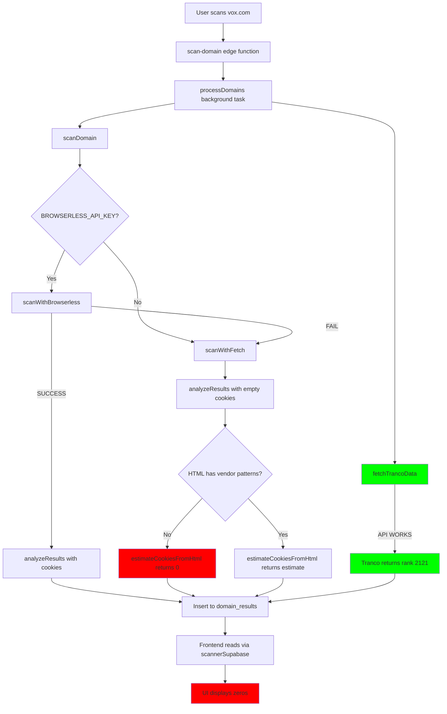

# DIAGNOSIS V7: Complete API Failure Analysis

**Date:** 2026-01-06  
**Status:** Strict Diagnostic Mode - No Edits Until Scope Complete  
**Issue:** All APIs appear to be returning zero/empty data (0 cookies, no vendors, no traffic)

---

## Executive Summary

The scanner shows **zero data** for all APIs:
- **0 cookies** (Total, First-Party, Third-Party all 0)
- **No vendors detected**
- **No traffic data** (0 impressions, $0 revenue)
- **Tranco API verified working** (tested directly - returns rank 2121 for vox.com)

This indicates a **data flow problem** between API calls and database storage/retrieval, not necessarily API failures.

---

## Architecture Flow Analysis



---

## Root Causes Identified

### Critical Issue 1: Browserless Silent Failure → Static Fetch → Empty Results

**Location:** `supabase/functions/scan-domain/index.ts` lines 528-543

**The Problem:**
1. Browserless API may be failing (invalid key, timeout, rate limit)
2. Error is logged but silently falls through to `scanWithFetch`
3. `scanWithFetch` gets HTML but **no cookies** (passes empty array `[]`)
4. `analyzeResults(html, [], domain)` is called with zero cookies
5. Cookie count = `cookies.length || estimateCookiesFromHtml(html)`
6. If HTML doesn't match vendor patterns, `estimateCookiesFromHtml` returns 0

**Evidence:**
- Screenshot shows 0 cookies for vox.com
- vox.com definitely has cookies (it's a major news site)
- Static fetch cannot capture cookies (they're set by JavaScript)

**Why This Happens:**
- Browserless may be:
  - Invalid/expired API key
  - Rate limited
  - Service down
  - Timeout (45s limit)
- Static fetch fallback is **fundamentally limited** - it can't execute JavaScript

---

### Critical Issue 2: Static Fetch Cannot Detect Real Cookies

**Location:** `supabase/functions/scan-domain/index.ts` line 692

```typescript
// Static analysis can't capture cookies, so estimate based on scripts
return analyzeResults(html, [], domain);
```

**The Problem:**
- Modern websites set cookies via JavaScript after page load
- Static `fetch()` only gets initial HTML
- Cookies set by:
  - Google Analytics (async script)
  - Meta Pixel (async script)
  - Consent managers (async script)
  - Ad tech vendors (async scripts)
- Are **completely invisible** to static fetch

**Result:** Even if vendor scripts are detected in HTML, cookie count is still 0 because:
- `cookies.length` = 0 (empty array)
- `estimateCookiesFromHtml` only estimates if patterns match
- If patterns don't match (e.g., minified code), estimate = 0

---

### Critical Issue 3: Tranco Data Not Displayed Despite API Working

**Location:** Multiple - data flow from API → DB → Frontend

**The Problem:**
- Tranco API **works** (verified: returns rank 2121 for vox.com)
- Data is fetched in `fetchTrancoData()` (line 256)
- Data is inserted into DB (lines 307-314)
- But UI shows "0" impressions

**Possible Causes:**
1. **Data not being stored** - Insert fails silently
2. **Data stored but not retrieved** - Frontend query issue
3. **Data retrieved but not displayed** - UI rendering issue
4. **Field name mismatch** - Database column vs TypeScript interface

**Investigation Needed:**
- Check if `tranco_rank`, `estimated_monthly_impressions` are actually in database
- Check if frontend is reading these fields correctly
- Check if UI component is using correct field names

---

### Issue 4: No Error Visibility When APIs Fail

**Location:** `supabase/functions/scan-domain/index.ts` lines 533-535

**The Problem:**
- Browserless errors are logged but **not stored in result**
- User sees zeros but doesn't know why
- No indication that:
  - Browserless failed
  - Fallback to static fetch was used
  - Static fetch has limitations

**Current Behavior:**
```typescript
} catch (err) {
  console.error(`[scan-domain] Browserless failed for ${domain}:`, err);
  // Falls through silently
}
```

**Should Be:**
- Store error reason in `error_message` field
- Set `status: 'partial'` if fallback was used
- Log which method was actually used

---

### Issue 5: Vendor Detection May Fail on Minified Code

**Location:** `supabase/functions/scan-domain/index.ts` lines 699-711

**The Problem:**
- Vendor patterns use regex on HTML string
- Modern sites minify JavaScript
- Patterns may not match:
  - `google-analytics.com` → might be `googletagmanager.com/gtag/js`
  - `fbq(` → might be `fbq=function(...)`
  - Scripts loaded via CDN with different URLs

**Result:** Even if vendors are present, detection fails → shows "No vendors detected"

---

### Issue 6: estimateCookiesFromHtml Logic Flaw

**Location:** `supabase/functions/scan-domain/index.ts` lines 744, 832-842

**The Problem:**
```typescript
const totalCookies = cookies.length || estimateCookiesFromHtml(html);
```

**Logic Issue:**
- If `cookies.length = 0` (which it always is for static fetch)
- Falls back to `estimateCookiesFromHtml(html)`
- But if HTML doesn't match patterns → returns 0
- **No fallback** - just returns 0

**Should Have:**
- Minimum estimate based on detected vendors
- Or return null/undefined to indicate "unknown" vs "zero"

---

## Data Flow Verification Needed

### Checkpoint 1: Is Browserless Actually Being Called?

**Test:** Check edge function logs for:
```
[scan-domain] Attempting Browserless scan for vox.com
```

**If Missing:** Browserless API key not set or check failed

---

### Checkpoint 2: Is Browserless Failing?

**Test:** Check logs for:
```
[scan-domain] Browserless failed for vox.com: [error message]
```

**If Present:** Browserless is failing → need to fix API key or service

---

### Checkpoint 3: Is Static Fetch Getting HTML?

**Test:** Check logs for:
```
[scan-domain] Falling back to static fetch for vox.com
```

**Then verify:** Does `scanWithFetch` succeed or throw?

---

### Checkpoint 4: Is Tranco Data Being Stored?

**Test:** Query database directly:
```sql
SELECT tranco_rank, estimated_monthly_impressions, estimated_monthly_pageviews
FROM domain_results
WHERE domain = 'vox.com'
ORDER BY scanned_at DESC
LIMIT 1;
```

**If NULL:** Data not being inserted (insert error or field mismatch)

---

### Checkpoint 5: Is Frontend Reading Data Correctly?

**Test:** Check browser console for:
```
[scannerApi] Scan results count: 1
[scannerApi] Scan results: [object with fields]
```

**Then verify:** Are `tranco_rank`, `estimated_monthly_impressions` in the object?

---

## Files Involved

| File | Issue | Lines |
|------|-------|-------|
| `supabase/functions/scan-domain/index.ts` | Browserless silent failure | 528-535 |
| `supabase/functions/scan-domain/index.ts` | Static fetch no cookies | 692 |
| `supabase/functions/scan-domain/index.ts` | Cookie estimation logic | 744, 832-842 |
| `supabase/functions/scan-domain/index.ts` | Tranco data insertion | 307-314 |
| `src/utils/scannerApi.ts` | Data retrieval | 791-807 |
| `src/pages/scanner/ScannerResults.tsx` | Data display | Various |

---

## Questions to Answer Before Fixing

1. **Is BROWSERLESS_API_KEY actually set in Supabase secrets?**
   - Check: `npx supabase secrets list`
   - If not set → that's why it's falling back

2. **Is Browserless API key valid?**
   - Test: Call Browserless API directly with the key
   - If invalid → need to update key

3. **What does the actual database record contain?**
   - Query: `SELECT * FROM domain_results WHERE domain = 'vox.com' LIMIT 1`
   - This will show if data is stored but not displayed

4. **What do edge function logs show?**
   - Check Supabase Dashboard → Edge Functions → scan-domain → Logs
   - Look for error messages, which method was used

5. **Is the frontend reading the correct fields?**
   - Check: `src/types/scanner.ts` field names vs database column names
   - Mismatch would cause zeros

---

## Recommended Investigation Order

1. **Check Supabase secrets** - Verify BROWSERLESS_API_KEY is set
2. **Check edge function logs** - See which path was taken
3. **Query database directly** - See what's actually stored
4. **Check browser console** - See what frontend receives
5. **Test Browserless API directly** - Verify key works

---

## Next Steps (After Investigation)

Once we know:
- Whether Browserless is being called
- Whether it's failing and why
- What's actually in the database
- What the frontend receives

Then we can fix the **root cause** instead of symptoms.

---

**Status:** Awaiting investigation results before proposing fixes.
